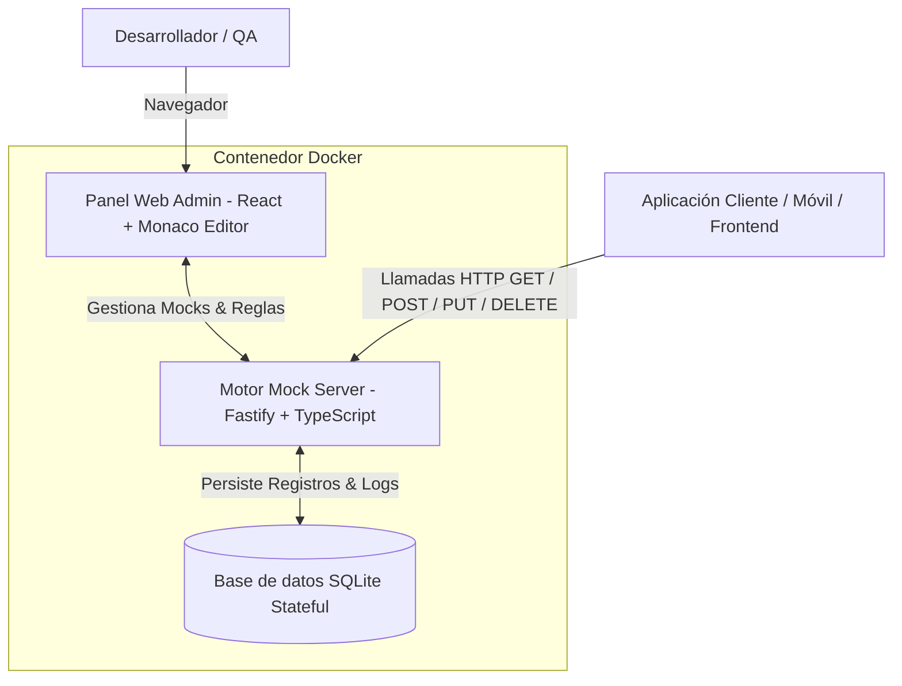

# 🚀 MockForge - Motor de Servidor Mock Dinámico & Panel Visual

🌐 **Language / Idioma / Idioma:**
[English](README.md) | [Português (Brasil)](README.pt-BR.md) | [Español](README.es.md)

---

[](https://github.com/viniciusfurtado/mockforge/actions/workflows/docker-publish.yml)
[](https://hub.docker.com/r/devfurtado/mockforge)
[](LICENSE)

**MockForge** es una solución completa y de alto rendimiento para la simulación de APIs inestables, en desarrollo o de terceros.
Recibe la estructura de cualquier modelo o contrato de documentación (JSON / OpenAPI / Schemas) y genera automáticamente datos falsos realistas (nombres, correos electrónicos, UUIDs, identificadores, precios, fechas, códigos) mediante **Faker**, con **persistencia stateful en SQLite**, **ajuste fino de tipos de campo** e **ingeniería de caos** (simulación de latencia y errores).

---

## 🏗️ Arquitectura



---

## ✨ Características Principales

- **🎨 Panel Web Visual Integrado**:
  - Editor de código tipo VS Code (**Monaco Editor**) con resaltado de sintaxis.
  - **Barra lateral colapsable** para maximizar el espacio de trabajo.
  - **Navegación de pestañas con flechas** (`<` y `>`).
  - **Playground tipo Postman** integrado para probar peticiones en tiempo real.
  - Panel de telemetría con filtrado de registros por mock específico y limpieza de historial.

- **🎯 Ajuste Fino de Tipos de Campo (Field Overrides)**:
  - Extrae automáticamente todos los campos de tu JSON en una tabla interactiva.
  - Personaliza el generador de cada campo: CNPJ, CPF, UUID, Cadena Numérica, Código Alfanumérico, Correo Electrónico, Nombre Completo, Empresa, Fechas, Moneda, Enteros, Booleanos.

- **⚙️ 3 Modos de Operación por Ruta**:
  - **🎲 Dynamic Faker**: Genera datos dinámicos y realistas en cada petición `GET`.
  - **💾 Stateful SQLite**: Simula el comportamiento de una base de datos real (`POST` guarda en SQLite; `GET` consulta guardados; `PUT/DELETE` actualizan y eliminan).
  - **📌 Estático**: Devuelve una respuesta JSON fija configurada.

- **⚡ Ingeniería de Caos & Simulación de Latencia**:
  - **Latencia Artificial**: Configurable de `0ms` a `5000ms`.
  - **Simulación de Errores**: Porcentaje configurable (`0%` a `100%`) de respuestas `500 Internal Server Error`.

---

## 📦 Guía de Instalación

### 1. Direct Pull de Docker Hub (Recomendado para Portainer / Producción)

```bash
docker run -d \
  -p 3001:3001 \
  -v $(pwd)/data:/app/data \
  --name mockforge \
  devfurtado/mockforge:latest
```

#### En Portainer / Docker Compose Stack:
```yaml
version: '3.8'

services:
  mockforge:
    image: devfurtado/mockforge:latest
    container_name: mockforge
    restart: unless-stopped
    ports:
      - "3001:3001"
    volumes:
      - ./data:/app/data
```

Accede al Panel Web en: **`http://localhost:3001`**

---

### 2. GitHub Container Registry (GHCR)

```bash
docker run -d \
  -p 3001:3001 \
  -v $(pwd)/data:/app/data \
  --name mockforge \
  ghcr.io/viniciusfurtado/mockforge:latest
```

---

### 3. Desarrollo Local

#### Backend (Fastify + SQLite):
```bash
cd backend
npm install
npm run dev
```

#### Frontend (React + Vite):
```bash
cd frontend
npm install
npm run dev
```

---

## 📝 Ejemplo de Estructura JSON

Pega cualquier JSON de ejemplo en la pestaña **Modelo JSON & Schema**:

```json
{
  "cnpjEmpresa": "00000000000191",
  "tokenConexao": "123e4567-e89b-12d3-a456-426614174000",
  "numeroPedido": "PED-2026-0001",
  "codigoAgencia": 1001,
  "codigoPosto": 501,
  "dataAtendimento": "2026-08-01T10:00:00.000Z",
  "itens": [
    {
      "codigoItem": "ITEM-001",
      "valorUnitario": 150.00
    }
  ]
}
```

MockForge preserva estrictamente los tipos primitivos (los números siguen siendo números) y genera datos coherentes.

---

## 🤝 Cómo Contribuir

¡Las contribuciones de desarrolladores de todo el mundo son bienvenidas! Ya sea solucionando errores, agregando nuevos generadores o traduciendo la documentación a nuevos idiomas.

1. Haz un Fork del repositorio
2. Crea tu rama de características (`git checkout -b feature/nueva-caracteristica`)
3. Realiza tus cambios (`git commit -m 'feat: agregar nueva caracteristica'`)
4. Haz push a la rama (`git push origin feature/nueva-caracteristica`)
5. Abre un Pull Request

---

## 📄 Licencia

Este proyecto está bajo la Licencia MIT - consulta el archivo [LICENSE](LICENSE) para más detalles.
