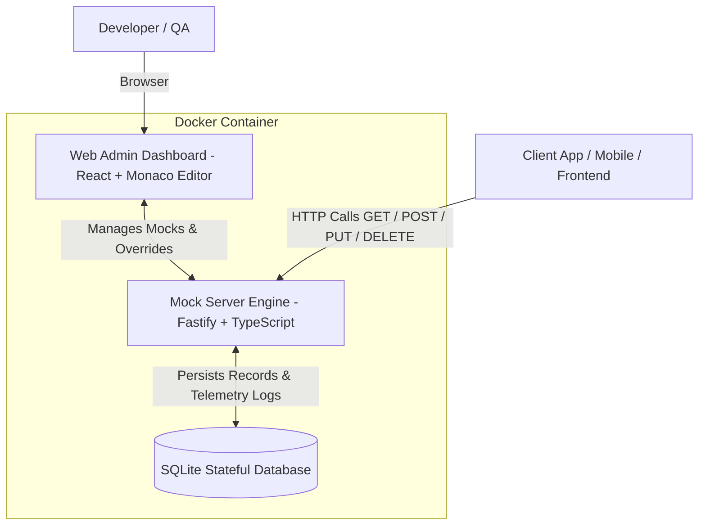

# 🚀 MockForge - Dynamic Mock Server Engine & Visual Dashboard

🌐 **Language / Idioma / Idioma:**
[English](README.md) | [Português (Brasil)](README.pt-BR.md) | [Español](README.es.md)

---

[](https://github.com/viniciusfurtado/mockforge/actions/workflows/docker-publish.yml)
[](https://hub.docker.com/r/devfurtado/mockforge)
[](LICENSE)

**MockForge** is a complete, high-performance solution for simulating unstable, in-development, or third-party APIs.
It takes any class or documentation contract structure (JSON / OpenAPI / Schemas) and automatically generates realistic mock datasets (names, emails, UUIDs, CPFs, CNPJs, prices, dates, codes) using **Faker**, along with **SQLite stateful persistence**, **field-level generator overrides**, and **chaos engineering** (latency & error rates).

---

## 🏗️ Architecture



---

## ✨ Features

- **🎨 Integrated Visual Web Dashboard**:
  - Code editor with VS Code syntax highlighting (**Monaco Editor**).
  - **Collapsible Sidebar** for maximizing workspace width.
  - **Scrollable Tabs Navigation** with arrow controls.
  - Built-in **Postman-style API Playground** to fire live requests directly from the UI.
  - Real-time telemetry dashboard with logs filtering per mock and log cleanup.

- **🎯 Field Schema Customizer & Overrides**:
  - Automatically extracts all fields from your JSON model into a visual mapping table.
  - Override generator types per field: CNPJ (Formatted/Numeric), CPF, UUID, Numeric String, Alphanumeric Code, Email, Full Name, Company, Dates, Currency, Integers, Booleans.

- **⚙️ 3 Operating Modes per Mock**:
  - **🎲 Dynamic Faker**: Generates fresh, realistic mock data on every `GET` request.
  - **💾 Stateful SQLite**: Simulates real database behaviour (`POST` inserts into SQLite, `GET` queries inserted items, `PUT/DELETE` update and remove).
  - **📌 Static**: Returns a custom fixed JSON payload.

- **⚡ Chaos Engineering & Latency Simulation**:
  - **Artificial Latency**: Configurable delay from `0ms` to `5000ms`.
  - **Error Rate Simulation**: Configurable percentage (`0%` to `100%`) of simulated `500 Internal Server Error` responses.

---

## 📦 Quick Start & Deployment

### 1. Docker Hub Pull (Recommended for Portainer / Production)

```bash
docker run -d \
  -p 3001:3001 \
  -v $(pwd)/data:/app/data \
  --name mockforge \
  devfurtado/mockforge:latest
```

#### Portainer / Docker Compose Stack:
```yaml
version: '3.8'

services:
  mockforge:
    image: devfurtado/mockforge:latest
    container_name: mockforge
    restart: unless-stopped
    ports:
      - "3001:3001"
    volumes:
      - ./data:/app/data
```

Access the Web Dashboard at: **`http://localhost:3001`**

---

### 2. GitHub Container Registry (GHCR)

```bash
docker run -d \
  -p 3001:3001 \
  -v $(pwd)/data:/app/data \
  --name mockforge \
  ghcr.io/viniciusfurtado/mockforge:latest
```

---

### 3. Local Development Setup

#### Backend (Fastify + SQLite):
```bash
cd backend
npm install
npm run dev
```

#### Frontend (React + Vite):
```bash
cd frontend
npm install
npm run dev
```

---

## 📝 Example JSON Input

Paste any JSON example into the **JSON Model & Schema** tab:

```json
{
  "cnpjEmpresa": "43035146004172",
  "senhaConexao": "40904f45-f72c-46b6-9924-1ac5d67c8e46",
  "numeroPedido": "0041PROT260731000001",
  "codigoAgenciaAtendimento": 2568,
  "codigoPostoAtendimento": 2134,
  "dataAtendimento": "2026-07-30T08:00:00.000Z",
  "gtve": [
    {
      "numeroGtv": "734670",
      "valorGtv": 100
    }
  ]
}
```

MockForge automatically preserves strict primitive types (numbers stay numbers) and generates valid matching domain mock data.

---

## 🤝 Contributing

Contributions from all over the world are welcome! Whether you are fixing a bug, adding generator presets, or translating documentation into new languages.

1. Fork the repository
2. Create your feature branch (`git checkout -b feature/amazing-feature`)
3. Commit your changes (`git commit -m 'feat: add awesome new feature'`)
4. Push to the branch (`git checkout -b feature/amazing-feature`)
5. Open a Pull Request

---

## 📄 License

This project is licensed under the MIT License - see the [LICENSE](LICENSE) file for details.
