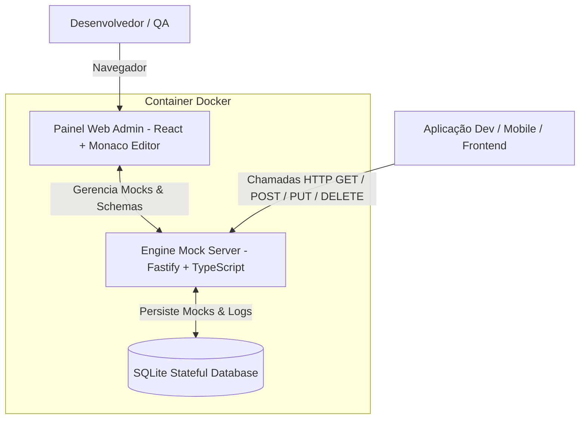

# 🚀 MockForge - Dynamic Mock Server Engine & Visual Dashboard

[](https://github.com/viniciusfurtado/mockforge/actions/workflows/docker-publish.yml)
[](https://github.com/viniciusfurtado/mockforge/pkgs/container/mockforge)
[](LICENSE)

**MockForge** é uma solução completa e de alta performance para simulação de APIs instáveis, em desenvolvimento ou externas. 
Ele permite cadastrar o modelo/estrutura da sua classe ou contrato da documentação (JSON / OpenAPI / Schemas) e gera automaticamente massas de dados realistas (nomes, e-mails, UUIDs, preços, datas, etc.) via **Faker**, além de oferecer modos de persistência stateful no **SQLite** e controle fino de instabilidade (latência e caos).

---

## 🏗️ Arquitetura



---

## ✨ Principais Recursos

- **🎨 Painel Web Visual Integrado**:
  - Editor de código estilo VS Code (**Monaco Editor**) com Syntax Highlighting.
  - **Playground estilo Postman** integrado para disparar requisições em tempo real sem sair do navegador.
  - Painel de telemetria com histórico e logs de requisições.

- **⚙️ 3 Modos de Operação por Rota**:
  - **🎲 Dynamic Faker**: Gera massa de dados novos e realistas a cada requisição `GET`.
  - **💾 Stateful SQLite**: Simula banco de dados real. `POST` salva o registro no SQLite local; `GET` busca os salvos; `PUT/DELETE` atualizam e removem.
  - **📌 Estático**: Retorna um JSON estático pré-configurado.

- **⚡ Engenharia de Caos & Simulação de Resiliência**:
  - **Latência Artificial**: De `0ms` a `5000ms`.
  - **Taxa de Erro Simulado**: De `0%` a `100%` para simular falhas artificiais `500 Internal Server Error`.

- **🔄 CI/CD Automatizado**:
  - Publicação automática da imagem Docker no **GitHub Container Registry (GHCR)** via GitHub Actions.

---

## 📦 Como Executar

### 1. Usando a imagem pré-compilada do GHCR (Mais Rápido)

```bash
docker run -d \
  -p 3001:3001 \
  -v $(pwd)/data:/app/data \
  --name mockforge \
  ghcr.io/viniciusfurtado/mockforge:latest
```

Acesse em: **`http://localhost:3001`**

---

### 2. Usando Docker Compose

Clone o repositório e execute:

```bash
git clone https://github.com/viniciusfurtado/mockforge.git
cd mockforge

docker compose up -d --build
```

---

### 3. Desenvolvimento Local

#### Backend (Fastify + SQLite):
```bash
cd backend
npm install
npm run dev
```

#### Frontend (React + Vite):
```bash
cd frontend
npm install
npm run dev
```

---

## 📝 Exemplo de Modelo no Cadastro

Cole qualquer JSON da sua documentação no painel:

```json
{
  "id": "uuid",
  "nome": "João da Silva",
  "email": "joao.silva@empresa.com",
  "cpf": "12345678901",
  "cargo": "Desenvolvedor Senior",
  "salario": 12500.00,
  "ativo": true,
  "dataAdmissao": "2024-03-15T08:00:00.000Z"
}
```

O **MockForge** infere automaticamente os tipos e associa handlers inteligentes do Faker.

---

## 🛠️ Tecnologias Utilizadas

- **Backend**: Node.js, Fastify, TypeScript, SQLite, `@faker-js/faker`.
- **Frontend**: React, Vite, TypeScript, Monaco Editor, Lucide Icons.
- **DevOps**: Docker, Docker Compose, GitHub Actions (GHCR).

---

## 📄 Licença

Este projeto está licenciado sob a licença MIT - consulte o arquivo [LICENSE](LICENSE) para obter detalhes.
