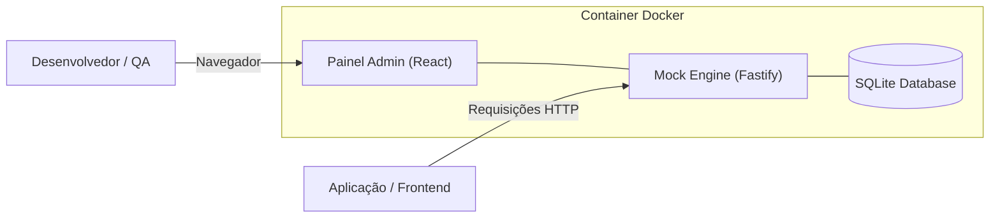

# 🚀 MockForge - Gerador de Mock Server Dinâmico & Painel Visual

🌐 **Language / Idioma / Idioma:**
[English](README.md) | [Português (Brasil)](README.pt-BR.md) | [Español](README.es.md)

---

[](https://github.com/viniciusfurtado/mockforge/actions/workflows/docker-publish.yml)
[](https://hub.docker.com/r/devfurtado/mockforge)
[](LICENSE)

**MockForge** é uma solução completa e de alta performance para simulação de APIs instáveis, em desenvolvimento ou externas.
Ele recebe a estrutura de qualquer classe ou contrato da documentação (JSON / OpenAPI / Schemas) e gera automaticamente massas de dados realistas (nomes, e-mails, UUIDs, CPFs, CNPJs, preços, datas, códigos) via **Faker**, além de oferecer **persistência stateful no SQLite**, **ajuste fino de tipagem de campos**, e **engenharia de caos** (simulação de latência e erros).

---

## 🏗️ Arquitetura



---

## ✨ Principais Recursos

- **🎨 Painel Web Visual Integrado**:
  - Editor de código estilo VS Code (**Monaco Editor**) com Syntax Highlighting.
  - **Sidebar Colapsável** para maximizar o espaço de trabalho.
  - **Barra de Abas Responsiva com Navegação por Setinhas** (`<` e `>`).
  - **Playground estilo Postman** integrado para disparar requisições em tempo real.
  - Painel de telemetria com histórico e filtro de logs por mock específico e limpeza de histórico.

- **🎯 Tipagem & Overrides de Campos**:
  - Extrai automaticamente todos os campos da estrutura JSON em uma tabela de mapeamento visual.
  - Altere o gerador de cada campo: CNPJ (Formatado/Numérico), CPF, UUID, String Numérica, Código Alfanumérico, E-mail, Nome Completo, Empresa, Datas, Valores Monetários, Inteiros, Booleans.

- **⚙️ 3 Modos de Operação por Rota**:
  - **🎲 Dynamic Faker**: Gera massa de dados novos e dinâmicos a cada requisição `GET`.
  - **💾 Stateful SQLite**: Simula banco de dados real. `POST` salva o registro no SQLite local; `GET` busca os salvos; `PUT/DELETE` atualizam e removem.
  - **📌 Estático**: Retorna um JSON estático pré-configurado.

- **⚡ Engenharia de Caos & Simulação de Resiliência**:
  - **Latência Artificial**: De `0ms` a `5000ms`.
  - **Taxa de Erro Simulado**: De `0%` a `100%` para simular falhas `500 Internal Server Error`.

---

## 📦 Como Executar

### 1. Direct Pull do Docker Hub (Recomendado para Portainer / Produção)

```bash
docker run -d \
  -p 3001:3001 \
  -v $(pwd)/data:/app/data \
  --name mockforge \
  devfurtado/mockforge:latest
```

#### No Portainer / Docker Compose Stack:
```yaml
version: '3.8'

services:
  mockforge:
    image: devfurtado/mockforge:latest
    container_name: mockforge
    restart: unless-stopped
    ports:
      - "3001:3001"
    volumes:
      - ./data:/app/data
```

Acesse o Painel Web em: **`http://localhost:3001`**

---

### 2. GitHub Container Registry (GHCR)

```bash
docker run -d \
  -p 3001:3001 \
  -v $(pwd)/data:/app/data \
  --name mockforge \
  ghcr.io/viniciusfurtado/mockforge:latest
```

---

### 3. Desenvolvimento Local

#### Backend (Fastify + SQLite):
```bash
cd backend
npm install
npm run dev
```

#### Frontend (React + Vite):
```bash
cd frontend
npm install
npm run dev
```

---

## 📝 Exemplo de Estrutura JSON

Cole qualquer estrutura JSON na aba **Modelo JSON & Schema**:

```json
{
  "cnpjEmpresa": "00000000000191",
  "tokenConexao": "123e4567-e89b-12d3-a456-426614174000",
  "numeroPedido": "PED-2026-0001",
  "codigoAgencia": 1001,
  "codigoPosto": 501,
  "dataAtendimento": "2026-08-01T10:00:00.000Z",
  "itens": [
    {
      "codigoItem": "ITEM-001",
      "valorUnitario": 150.00
    }
  ]
}
```

O MockForge preserva rigorosamente os tipos primitivos (números permanecem números) e gera dados mockados coerentes.

---

## 🤝 Como Contribuir

Contribuições de desenvolvedores de todo o mundo são super bem-vindas! Seja corrigindo bugs, adicionando novos presets de geradores ou traduzindo a documentação para novas línguas.

1. Faça um Fork do repositório
2. Crie sua branch de funcionalidade (`git checkout -b feature/minha-funcionalidade`)
3. Faça o commit das suas alterações (`git commit -m 'feat: minha nova funcionalidade'`)
4. Faça o push para a branch (`git push origin feature/minha-funcionalidade`)
5. Abra um Pull Request

---

## 📄 Licença

Este projeto está licenciado sob a licença MIT - consulte o arquivo [LICENSE](LICENSE) para obter detalhes.
