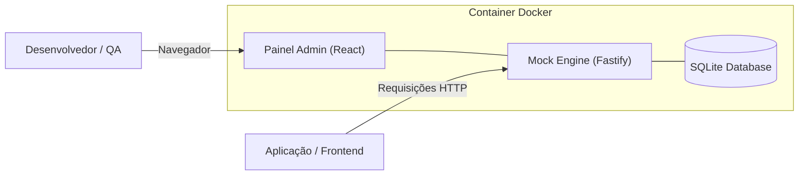

# 📚 Wiki do Projeto MockForge

Bem-vindo à Wiki oficial do **MockForge**! Esta documentação abrange em detalhes a arquitetura, os modos de operação, o uso via Docker, a customização de geradores de dados e o guia de contribuição.

---

## 📑 Sumário

1. [Visão Geral & Arquitetura](#1-visão-geral--arquitetura)
2. [Modos de Operação de Rotas](#2-modos-de-operação-de-rotas)
   - [Dynamic Faker](#-dynamic-faker)
   - [Stateful SQLite](#-stateful-sqlite)
   - [Estático](#-estático)
3. [Tipagem e Overrides de Campos (Faker)](#3-tipagem-e-overrides-de-campos-faker)
4. [Engenharia de Caos (Chaos Engineering)](#4-engenharia-de-caos-chaos-engineering)
5. [Guia de Deploy & Docker](#5-guia-de-deploy--docker)
   - [Docker Run](#docker-run)
   - [Docker Compose / Portainer](#docker-compose--portainer)
   - [Desenvolvimento Local](#desenvolvimento-local)
6. [Guia de Contribuição Open Source](#6-guia-de-contribuição-open-source)

---

## 1. Visão Geral & Arquitetura

O **MockForge** foi concebido para resolver o problema de dependência de APIs em desenvolvimento, instáveis ou de terceiros durante o ciclo de desenvolvimento frontend e testes de QA.

### Diagrama de Arquitetura



- **Frontend:** React + Vite + Monaco Editor (Editor estilo VS Code) + TailwindCSS.
- **Backend:** Fastify + TypeScript + Better-SQLite3.
- **Engine Faker:** `@faker-js/faker` para geração inteligente de dados em Português e Inglês.

---

## 2. Modos de Operação de Rotas

Ao cadastrar ou editar um endpoint no MockForge, você pode definir como ele se comportará:

### 🎲 Dynamic Faker
- **Descrição:** A cada requisição `GET`, o MockForge processa o modelo JSON/Schema cadastrado e substitui os valores por dados fictícios novos e aleatórios via Faker.
- **Uso ideal:** Listagens dinâmicas, feed de dados, testes de renderização de listas extensas.

### 💾 Stateful SQLite
- **Descrição:** O mock simula um banco de dados relacional real:
  - **`POST`**: Insere o novo objeto enviado no corpo da requisição no SQLite local.
  - **`GET`**: Retorna a lista dos objetos salvos ou um objeto específico por ID (`/api/v1/users/:id`).
  - **`PUT / PATCH`**: Atualiza as propriedades do registro existente.
  - **`DELETE`**: Remove o registro do banco.
- **Uso ideal:** Fluxos de CRUD completos no frontend sem necessidade de backend real pronto.

### 📌 Estático
- **Descrição:** Retorna exatamente o payload JSON cadastrado na interface, sem alterações.
- **Uso ideal:** Testar respostas específicas de erro de domínio, tokens de autenticação mockados ou contratos fixos.

---

## 3. Tipagem e Overrides de Campos (Faker)

O MockForge analisa recursivamente a estrutura JSON fornecida e extrai uma tabela com todas as chaves.

### Mapeamentos de Geradores Disponíveis:

| Tipo | Exemplo de Saída |
| :--- | :--- |
| **CPF** | `123.456.789-00` ou `12345678900` |
| **CNPJ** | `43.035.146/0001-72` |
| **UUID** | `40904f45-f72c-46b6-9924-1ac5d67c8e46` |
| **E-mail** | `usuario.exemplo@provedor.com` |
| **Nome Completo** | `Carlos Eduardo Silva` |
| **Empresa** | `GFTech Soluções LTDA` |
| **Telefone** | `(11) 98765-4321` |
| **Data/Hora** | ISO 8601 (`2026-08-04T12:00:00.000Z`) |
| **Valores Monetários** | `149.90` (numérico) |
| **Booleans & Inteiros** | Preservam o tipo primitivo exato |

---

## 4. Engenharia de Caos (Chaos Engineering)

Para testar o tratamento de falhas, carregamento e resiliência da sua aplicação, cada rota possui dois controles independentes:

1. **Atraso de Resposta (Latência Artificial):**
   - Intervalo configurável de `0ms` até `5000ms`.
   - Permite testar *skeleton screens*, *spinners* de loading e rotas lentas.

2. **Taxa de Erro Simulado (Chaos Error Rate):**
   - Porcentagem de `0%` a `100%`.
   - Quando ativada (ex: `20%`), 1 a cada 5 requisições aleatórias retornará `500 Internal Server Error (Simulated Chaos)`.

---

## 5. Guia de Deploy & Docker

O MockForge é distribuído como uma imagem Docker única e otimizada (Multi-stage build).

### Docker Run
```bash
docker run -d \
  -p 3001:3001 \
  -v $(pwd)/data:/app/data \
  --name mockforge \
  devfurtado/mockforge:latest
```

### Docker Compose / Portainer
```yaml
version: '3.8'

services:
  mockforge:
    image: devfurtado/mockforge:latest
    container_name: mockforge
    restart: unless-stopped
    ports:
      - "3001:3001"
    volumes:
      - ./data:/app/data
```

### Desenvolvimento Local

```bash
# Clone o repositório
git clone https://github.com/viniciusfurtado/mockforge.git
cd mockforge

# Iniciar Backend
cd backend
npm install
npm run dev

# Iniciar Frontend em outro terminal
cd frontend
npm install
npm run dev
```

---

## 6. Guia de Contribuição Open Source

Incentivamos contribuições da comunidade!

1. **Fork o repositório**: [https://github.com/viniciusfurtado/mockforge](https://github.com/viniciusfurtado/mockforge)
2. **Crie uma branch temática**: `git checkout -b feat/novo-gerador-faker`
3. **Faça o commit de suas alterações**: `git commit -m 'feat: adicionar novo gerador de Inscrição Estadual'`
4. **Envie para a branch**: `git push origin feat/novo-gerador-faker`
5. **Abra um Pull Request** detalhado explicando as alterações.
